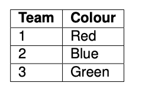
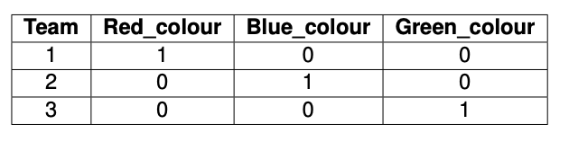
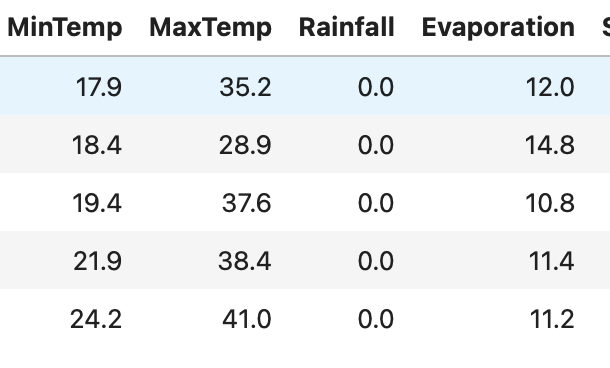
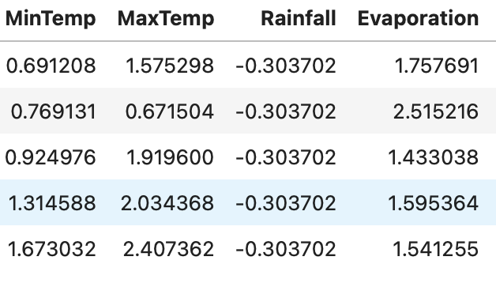
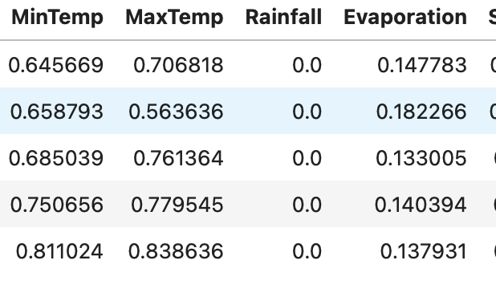

# Introduction to Machine Learning Using Dask
This tutorial introduces the concepts of Machine Learing Using Dask.

Learning outcomes of the tutorial are:
1. Learn how to do data prepocessing.
2. Learn how to implement a linear regression model.
3. Learn how to implement a K-Means clustering Model.
4. Learn how to cross validate a model. 
5. Learn how to build ML pipelines.

Prerequisite:
1. Experience with Scikit Learn library
2. Experience with Dask Dataframe and Dask Arrays 

***

## Data Preprocessing

The first process step in building a machine learning model is data preprocssing. This mainly involves:
1. Removing any unnecessary observations from your dataset.
2. Removng redundant information.
3. Removing duplicate information.
4. Removing structural errors in data collection.
5. Removing unwanted outliers - outliers can result in overfitting.
6. Handling missing data- Removing observations with values missing or Infering the missing values.

### Categorical Data to Numerical Data

A Dataset usually have numerical data and categorical data. Categorical data groups information (usually text) with similar characteristics. Numerical data expresses information in the form of numbers. Most machine learning algorithms cannot handle categorical variables unless it is converted to numerical data. This process is called __encoding__.




```

from dask_ml.preprocessing import Categorizer, DummyEncoder
        
de = DummyEncoder()
ddf_features_preproc = de.fit_transform(ddf_features.categorize())

```

### Data Standardization

Data standardization becomes relevant when there are substantial variations in the ranges of features within the input dataset or when those features are measured using different units (meteres, kilogram). 




```

from dask_ml.preprocessing import MinMax
        
MinMax = MinMaxScaler()
MinMax_scalar = MinMax.fit(ddf_features_preproc)
ddf_features_norm = MinMax.fit_transform(ddf_features_preproc)
        
```

### Data Normalization

Normalization  is the process of translating data into a range. It is a good practice to normalize the data - especially useful when different features have different value ranges. Normalization ensures that one feature does not overtly influence the model. 

In most cases data standization is preffered over normalization. In this tutorial we demonstrate both.



```

from dask_ml.preprocessing import StandardScaler
        
scaler = StandardScaler()
scalar_norm = scaler.fit(ddf_features_preproc)
ddf_features_std = scaler.fit_transform(ddf_features_preproc)
        
```

### Principal Component Analysis
Principal Component Analysis (PCA) is a technique frequently employed for the purpose of reducing the dimensionality of large datasets. It accomplishes this by converting a comprehensive array of variables into a more compact representation that retains the majority of the vital information present in the original dataset.

```

pca = PCA(n_components=3)
pca.fit(ddf_features_norm.to_dask_array(lengths=True))
PCA(copy=True, iterated_power='auto', n_components=3, random_state=None, svd_solver='auto', tol=0.0, whiten=False)

```

## Linear Regression


***
## References
1. https://tutorial.dask.org/00_overview.html
2. https://ml.dask.org
3. https://jobqueue.dask.org/en/latest/generated/dask_jobqueue.PBSCluster.html
4. https://examples.dask.org/machine-learning/incremental.html
5. https://examples.dask.org/machine-learning/training-on-large-datasets.html
6. https://examples.dask.org/machine-learning/parallel-prediction.html
7. https://examples.dask.org/machine-learning.html


*** 
## Contributers
1. [Joseph John](https://www.josephjohn.org), Staff Scientist - Training, National Computational Infrastructure (NCI).


