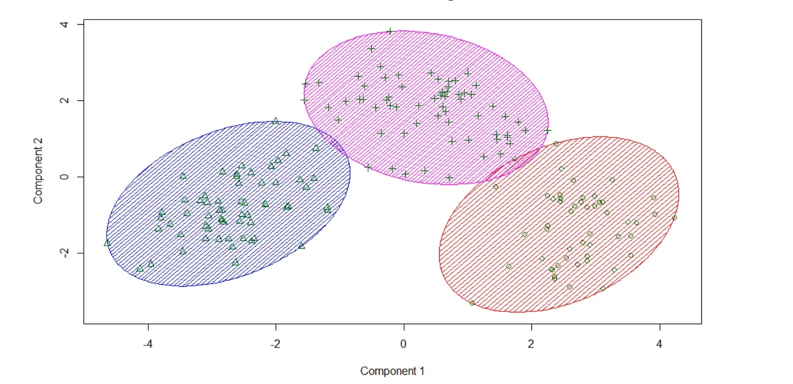

# Introduction to Machine Learning Using Dask
This tutorial introduces the concepts of Machine Learing Using Dask.

Learning outcomes of the tutorial are:
1. Learn how to do data prepocessing.
2. Learn how to implement a linear regression model.
3. Learn how to implement a K-Means clustering Model.
4. Learn how to cross validate a model. 
5. Learn how to build ML pipelines.

Prerequisite:
1. Experience with Scikit Learn library
2. Experience with Dask Dataframe and Dask Arrays 

***

## Data Preprocessing

The first process step in building a machine learning model is data preprocssing. This mainly involves:
1. Removing any unnecessary observations from your dataset.
2. Removng redundant information.
3. Removing duplicate information.
4. Removing structural errors in data collection.
5. Removing unwanted outliers - outliers can result in overfitting.
6. Handling missing data- Removing observations with values missing or Infering the missing values.

### Categorical Data to Numerical Data

A Dataset usually have numerical data and categorical data. Categorical data groups information (usually text) with similar characteristics. Numerical data expresses information in the form of numbers. Most machine learning algorithms cannot handle categorical variables unless it is converted to numerical data. This process is called __encoding__.


```

from dask_ml.preprocessing import Categorizer, DummyEncoder
        
de = DummyEncoder()
ddf_features_preproc = de.fit_transform(ddf_features.categorize())

```

### Data Standardization

Data standardization becomes relevant when there are substantial variations in the ranges of features within the input dataset or when those features are measured using different units (meteres, kilogram). 


```

from dask_ml.preprocessing import MinMax
        
MinMax = MinMaxScaler()
MinMax_scalar = MinMax.fit(ddf_features_preproc)
ddf_features_norm = MinMax.fit_transform(ddf_features_preproc)
        
```

### Data Normalization

Normalization  is the process of translating data into a range. It is a good practice to normalize the data - especially useful when different features have different value ranges. Normalization ensures that one feature does not overtly influence the model. 

In most cases data standization is preffered over normalization. In this tutorial we demonstrate both.


```

from dask_ml.preprocessing import StandardScaler
        
scaler = StandardScaler()
scalar_norm = scaler.fit(ddf_features_preproc)
ddf_features_std = scaler.fit_transform(ddf_features_preproc)
        
```

### Principal Component Analysis
Principal Component Analysis (PCA) is a technique frequently employed for the purpose of reducing the dimensionality of large datasets. It accomplishes this by converting a comprehensive array of variables into a more compact representation that retains the majority of the vital information present in the original dataset.

```

pca = PCA(n_components=3)
pca.fit(ddf_features_norm.to_dask_array(lengths=True))
PCA(copy=True, iterated_power='auto', n_components=3, random_state=None, svd_solver='auto', tol=0.0, whiten=False)

```
***

## Linear Regression
Linear regression is used to predict the value of a variable based on the value of another variable or a set of varibales. It a type of **Supervised Learning**. Supervised machine learning involves the process of establishing a connection between input variables and output variables. The input variabls are often called features or independent variables, while the output is commonly denoted as the target or 'dependent variables. Data containing both these features and the target is typically termed labeled data.

Linear regression tries to find the optimal W<sub>1</sub>, W<sub>2</sub>, W<sub>3</sub>, W<sub>4</sub>, so that we can predict the value of Y for the user-supplied X<sub>1</sub>, X<sub>2</sub>, X<sub>3</sub>.

$$
  Y(X_1, X_2, X_3) = W_1 * X_1 + W_2 * X_2 + W_3 * X_3 + W_4
$$

```
lr = LinearRegression(solver_kwargs={"normalize":False})
lr.fit(X, Y)
predicted_value = lr.predict(x)
```
***

## K-Means Clustering

k-means clustering partition n observations into k clusters in which each observation belongs to the cluster with the nearest mean (cluster centroid). k-means clustering is a type of **Unsupervised Learning**. In unsupervised learning the algorithm groups or patterns without the need of labeled data.

```
kmeans = KMeans(n_clusters=3, init_max_iter=1, oversampling_factor=8)
kmeans.fit(data)
```


## Cross Validation

Cross-validation is a method for evaluating ML models by training several ML models on subsets of the data and evaluating another subset of the data. The advantages of cross validation are : 

1. Identify Overfitting
2. Comparison between different models 
3. Hyperparameter tuning
4. Efficiency : Allows the use of data for both training and validation

```
X_train, X_test, y_train, y_test = train_test_split(ddf_features_norm, ddf_target, shuffle=False)
lr.fit(X_train, Y_train)
lr.score(X_tesy, Y_test)
```
***

## Pipelines in ML

he pipeline's objective is to combine multiple steps that can be cross-validated as a cohesive unit, all while adjusting various parameters. Various machine learning steps can be interconnected within a unified pipeline object.

***
## References
1. https://tutorial.dask.org/00_overview.html
2. https://ml.dask.org
3. https://jobqueue.dask.org/en/latest/generated/dask_jobqueue.PBSCluster.html
4. https://examples.dask.org/machine-learning/incremental.html
5. https://examples.dask.org/machine-learning/training-on-large-datasets.html
6. https://examples.dask.org/machine-learning/parallel-prediction.html
7. https://examples.dask.org/machine-learning.html


*** 
## Contributers
1. [Joseph John](https://www.josephjohn.org), Staff Scientist - Training, National Computational Infrastructure (NCI).


